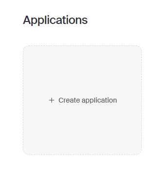
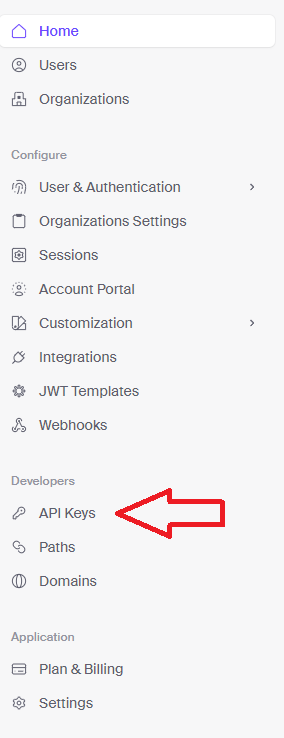

# Fullstack Notion Clone: Next.js 13, React, Convex, Tailwind | Full Course 2023

Following [this](https://www.youtube.com/watch?v=0OaDyjB9Ib8) tutorial

# Setup

```sh
npm install
npm run dev
```

In another terminal, setup convex with:

```sh
npx convex dev
```

You may be prompted to login and setup if it is your first time

In [clerk](https://clerk.com/)

-   Sign in and go to the dashboard
-   Create a new application 
-   Copy `NEXT_PUBLIC_CLERK_PUBLISHABLE_KEY` and `CLERK_SECRET_KEY` from Clerk's Dashboard (Under Developers > API Keys) into `.env.local` 
-   Click `JWT Templates` > `New template` > `convex` and save

In [edgestore](https://edgestore.dev/)

-   Create a new account and go to the dashboard
-   Create a new project
-   Copy `EDGE_STORE_ACCESS_KEY` and `EDGE_STORE_SECRET_KEY` into `.env.local`

# Resources

-   [Clerk Documentation](https://clerk.com/docs/quickstarts/nextjs)
-   [Edge store Documentation](https://edgestore.dev/docs/quick-start)
-   [Convex](https://www.convex.dev/)
-   [Gitub for tutorial](https://github.com/AntonioErdeljac/notion-clone-tutorial)
